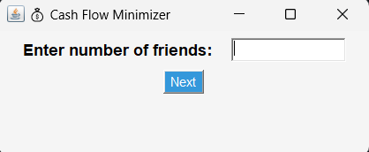
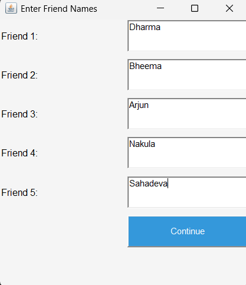
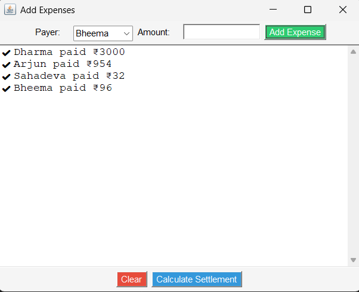
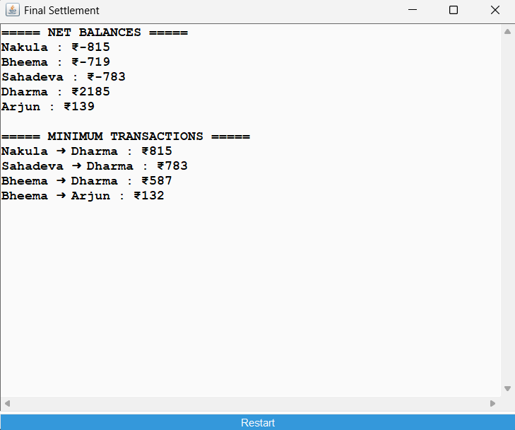

# 💰 Cash Flow Minimizer

A **Java AWT-based desktop application** that helps groups of friends minimize the number of transactions required to settle shared expenses.

Instead of everyone paying everyone else, the application calculates the **minimum number of payments required** so that all balances are settled.

This project demonstrates the use of **Data Structures and Algorithms (DSA)** concepts in a real-world scenario.

---

# 📌 Problem Statement

When friends share expenses (trips, dinners, rent, etc.), everyone may pay different amounts.
Manually calculating who owes whom can become confusing.

The **Cash Flow Minimizer** solves this by:

1. Tracking expenses among friends
2. Calculating each person's net balance
3. Reducing the total number of transactions required to settle debts

The program uses a **greedy algorithm with priority queues** to compute the optimal solution.

---

# 🚀 Features

✅ Interactive GUI built using **Java AWT**
✅ Add multiple friends
✅ Record multiple expenses
✅ Automatically split expenses among all participants
✅ Compute **minimum number of transactions** required
✅ Restart the calculation easily
✅ Colorful and user-friendly interface

---

# 🧠 Data Structures Used

This project demonstrates the use of important **DSA concepts**:

| Data Structure                       | Purpose                          |
| ------------------------------------ | -------------------------------- |
| ArrayList                            | Store friends and expenses       |
| HashMap                              | Store net balances               |
| Priority Queue (Max Heap / Min Heap) | Find largest creditor and debtor |
| Greedy Algorithm                     | Minimize number of transactions  |

---

# ⚙️ Algorithm Overview

1. Record all expenses.
2. Calculate each friend's **net balance**.
3. Separate people into:

   * **Creditors** (positive balance)
   * **Debtors** (negative balance)
4. Use **Priority Queues** to repeatedly match:

   * Largest creditor
   * Largest debtor
5. Create transactions until balances become zero.

This ensures the **minimum number of settlements**.

---

# 🖥️ Application Workflow

1️⃣ Enter the number of friends
2️⃣ Enter the names of all friends
3️⃣ Add expenses and select who paid
4️⃣ Click **Calculate Settlement**
5️⃣ View optimized transactions

---

# 📷 Application Screenshots

## Friend Count Input



---

## Enter Friend Names



---

## Adding Expenses



---

## Final Settlement Output



---

# 📂 Project Structure

```
CashFlowMinimizer
│
├── src
│   └── sample
│       └── Com
│           └── CashFlowMinimizer.java
│
├── screenshots
│   ├── friend_count.png
│   ├── friend_names.png
│   ├── add_expenses.png
│   └── final_settlement.png
│
└── README.md
```

---

# 🛠️ Technologies Used

* **Java**
* **Java AWT (GUI)**
* **Data Structures**
* **Priority Queue**
* **Greedy Algorithm**

---

# ▶️ How to Run the Project

Compile:

```
javac sample/Com/CashFlowMinimizer.java
```

Run:

```
java sample.Com.CashFlowMinimizer
```

---

# 📊 Example

Suppose:

| Friend  | Paid  |
| ------- | ----- |
| Alice   | ₹1000 |
| Bob     | ₹0    |
| Charlie | ₹0    |

Instead of multiple payments, the program will output:

```
Bob ➜ Alice : ₹333
Charlie ➜ Alice : ₹333
```

Thus minimizing transactions.

---

# 🎯 Learning Outcomes

Through this project you can learn:

* Practical use of **Data Structures**
* GUI programming with **Java AWT**
* Implementation of **Greedy algorithms**
* Designing interactive desktop applications

---

# 📈 Future Improvements

Possible upgrades:

* Swing / JavaFX modern UI
* Graph visualization of transactions
* Export settlements as PDF
* Web-based version

---

# 👩‍💻 Author

**Akshaya Regidi**

GitHub:
https://github.com/akshayaregidi07-source

---

⭐ If you like this project, feel free to **star the repository**!
